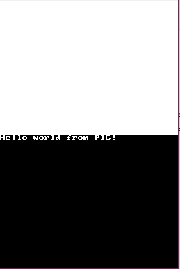

# Position Independent Code on the DS

## Introduction

This is an attempt to compile position independent code on Nintendo DS.

In a DS homebrew, (almost) all programming resources (code, data, variables) are by default placed together in the 4MB EWRAM.
While there exist ways to move the read-only data out of the work memory (e.g. on nitroFS or SD card), there is no direct way
to store code in a place where it can be dynamically loaded at runtime. For a large project with plenty of features which may not all
be simultaneously in use, it would result in a large portion of unused code residing in the precious RAM. The aim of this project is 
to provide an easy to use system for dynamic loading and linking of position-independent code (PIC).

To my knowledge, this is not a widely discussed subject and I had a hard time trying to find web materials on this topic. There is 
information about PIC in general, but not related to the DS and especially the use case I'm trying to approach.

## The working principle

Position-independent code is a sequence of instructions that can be executed from any possible address. Instead of using fixed absolute
offsets for accessing symbol names, it makes use of the program counter `pc` and other mechanisms to perform relative addressing.

In this project, a PIC module is a collection of code, data, and symbols which can be loaded from an external source (e.g. nitro filesystem) at a
random allocated address in EWRAM. The runtime image is a single memory block, consisting of adjacent segments for code (.text), read-only data (.rodata),
initialized (.data) and unitialized (.bss) variables. The PICEx (PIC Executor) engine is responsible for managing these modules. It can also call functions
inside a module by casting a certain address to a C function pointer.

## Build

```
git clone https://github.com/NotImplementedLife/hello_world_pic
cd hello_world_pic
cd picex && make
cd ../example
make
```

Now you can run example.nds.




## To do list

- ✔️ Achieve simple PIC proof of concept
- ✔️ Load/Unload module
- ✔️ Ensure easy build with Makefiles
- ⌛ The PIC module can use host functions ("main API") like malloc
- ⌛ The PIC module can use symbols from other PIC modules
